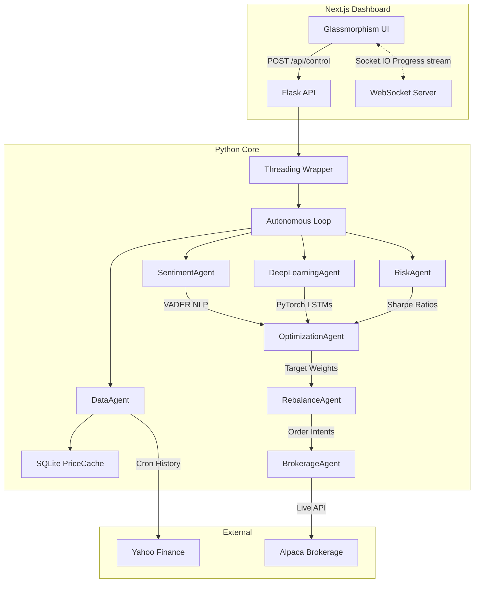

# 🚀 PortfolioAI: Autonomous Neural-Quant Management


**PortfolioAI** is a premium, enterprise-grade autonomous portfolio management workstation. It actively scans market data, builds sequences for PyTorch Deep Neural Networks to predict volatility, checks NLP sentiment via VADER on financial news, and utilizes rigorous Scipy mathematical constraints to deliver the ultimate mathematically-optimal portfolio. 

All of this happens live via streaming background architecture on a highly-aesthetic Glassmorphic Cyber-Premium frontend.

---

## 🛠 Features

* **Multi-Tenant SaaS Architecture:** Complete `SQLite/SQLAlchemy` isolation allows for tens of thousands of unique User IDs and simultaneous auto-trading portolios.
* **Cyber-Premium UI/UX:** A bespoke deep space gradient aesthetic with buttery-smooth `framer-motion` layout animations and frosted `backdrop-blur` glass panels.
* **Zero-Lag WebSockets:** Heavy ML predictions happen securely in background detached Python threads, pushing real-time progress updates to the frontend via `Socket.IO`. 
* **Live Alpaca Broker Integration:** Automatically acts on algorithmic decisions by generating specific HTTP execution requests to Alpaca Market or Limit order ledgers.
* **Frictional Cost Safeguard:** Protects users against algorithmic overkill by aborting small optimal rebalances if the broker slippage/fees will drag the portfolio capital down.

---

## 🧠 System Architecture

PortfolioAI follows a strict **Sense-Analyze-Decide-Act** micro-agent architecture to prevent spaghetti code and enforce strict risk management.



---

## 🔬 Algorithm Deep Dives

### 1. PyTorch Sequence Modeling (`dl_predict_agent.py`)
Instead of lagging classical models, PortfolioAI uses a Deep Neural Network structured as an **LSTM (Long Short-Term Memory)**. It splits historical logarithmic returns into highly-dimensional sequences (`batch_first=True`) so the NN can inherently "remember" prior volatility swings and predict highly probable directional movements.

### 2. VADER Sentiment Scoring (`sentiment_agent.py`)
Mathematical models lack world awareness. The `SentimentAgent` runs daily news blocks through the VADER NLP dictionary to derive a Compound Score from `-1.0` (Catastrophic) to `+1.0` (Phenomenal). This maps globally into an expected-return multiplier (e.g. slashing predictions by 20% on bad news before optimizing begins).

### 3. Frictional Constraint Math (`rebalance_agent.py`)
The rebalance agent prevents hyper-active trading. It measures the theoretical Turnover (Total Absolute Weight Deviations / 2). If the explicit estimated trading fees of that turnover exceed `0.5%` of the portfolio's absolute value, it mathematically aborts the trade, waiting for deeper deviations to maximize capital efficiency.

---

## 💻 Local Developer Setup

To deploy the entire stack locally with real-time hot reloading:

### 1. Install Global Requirements
Ensure you have **Python 3.10+** (with C++ build tools for PyTorch) and **Node.js 18+** installed.

### 2. Setup the Python Agent Infrastructure
```bash
# In the repository root
cd backend
python -m venv .venv

# Windows Powershell
.\.venv\Scripts\Activate.ps1
# OR Mac/Linux
source .venv/bin/activate

pip install -r requirements.txt
```
*(Note: Since this architecture includes `torch`, installation might take a few moments depending on your GPU/binary configuration).*

### 3. Setup the Alpaca Data Keys
Copy `.env.example` to `.env` inside the `backend` directory. Fill in your Alpaca API Paper Trading keys so the `BrokerageAgent` can securely sign execution URLs.

### 4. Boot the Next.js Cytber-Premium Frontend
```bash
# In a secondary terminal, start from repository root
npm install --legacy-peer-deps
npm run dev
```

### 5. Finalize Configuration
1. Your frontend is instantly available at [http://localhost:3000](http://localhost:3000).
2. Start the Backend API by running `python backend/app.py` in your active python terminal.
3. Click **"Run Autonomous Agent"** to observe your LSTMs firing in terminal logs alongside Socket.IO visually updating your frontend sequentially!
